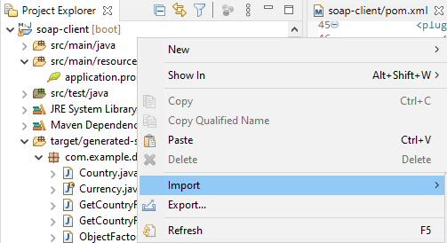
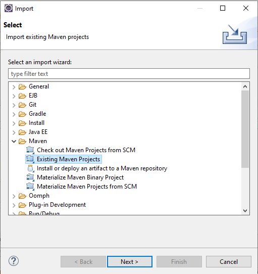
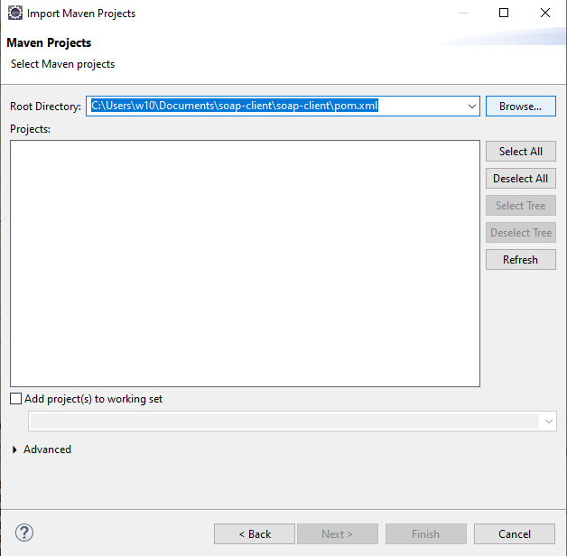
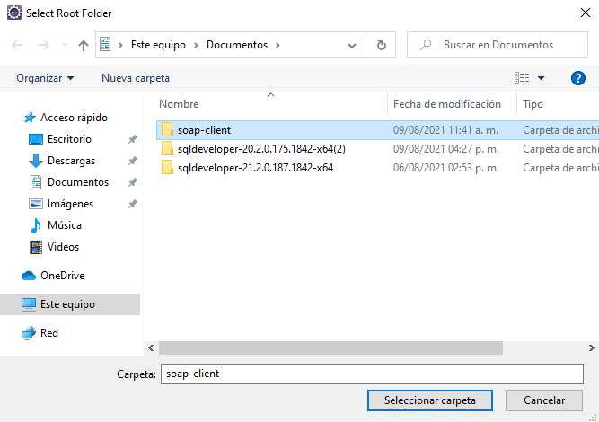
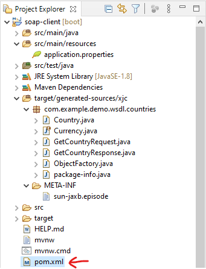
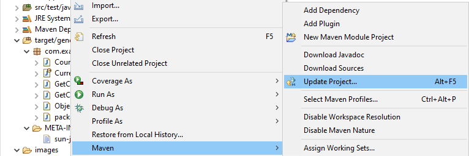

# Getting Started

### Reference Documentation
For further reference, please consider the following sections:

* [Official Apache Maven documentation](https://maven.apache.org/guides/index.html)
* [Spring Boot Maven Plugin Reference Guide](https://docs.spring.io/spring-boot/docs/2.5.3/maven-plugin/reference/html/)
* [Create an OCI image](https://docs.spring.io/spring-boot/docs/2.5.3/maven-plugin/reference/html/#build-image)
* [Spring Web Services](https://docs.spring.io/spring-boot/docs/2.5.3/reference/htmlsingle/#boot-features-webservices)
* [Spring Boot DevTools](https://docs.spring.io/spring-boot/docs/2.5.3/reference/htmlsingle/#using-boot-devtools)

### Guides
The following guides illustrate how to use some features concretely:

* [Producing a SOAP web service](https://spring.io/guides/gs/producing-web-service/)

# Consumir SOAP Web Service

Continuación de: #Producing SOAP Web Service

# Construcción de un Servicio REST

### Para crear el proyecto:

Primero visitar la página [Spring Initializr](https://start.spring.io) para crear el arquetipo con Maven. Para este proyecto se requiere la versión 8 de Java, usar la versión 2.5.3 de Spring y agregar la siguiente dependencia:

* Spring Web Services: debe seleccionarse desde _Dependencies_

El nombre de _artifact_ y _name_ del proyecto: **soap-client**
El nombre del paquete debe ser: **com.example.demo**

Una vez listo, dar click en **Generate**

Lo cual nos descargará una carpeta con el arquetipo, el cual procederemos a importarlo a nuestro IDE Eclipse. Recuerda que solo debes seleccionar la carpeta del proyecto para que detecte el **POM.xml**

Hacer click derecho en la sección de _Project Explorer_ para que aparezca la opción _Import:_

Después de seleccionar la opción _Import_ tenemos varias opciones, elegimos **Maven** --> **Existing Maven Projects**

Y damos click en _Continue_

Despúes elegimos la ubicación de la carpeta que contiene el arquetipo que descargamos desde Spring Initialzr:

 

Y desde el explorador de Windows, seleccionamos la carpeta **soap-client**

Una vez cargue el proyecto, damos click en el **POM.xml**

A continuación, desde el POM.xml del proyecto, se añadirá la siguiente dependencia y un plugin, cuidando que las etiquetas se encuentren dentro de sus respectivos bloques:

**jaxb Runtime:**
Jaxb permite almacenar y recuperar datos en memoria en cualquier formato XML, sin la necesidad de implementar un conjunto específico de rutinas de carga y guardado de XML para la estructura de clases del programa.

``<dependency>
	<groupId>org.glassfish.jaxb</groupId>
	<artifactId>jaxb-runtime</artifactId>
  </dependency>``
 
 **Esta excepción del plugin es para trabajar con archivos en XML:**
 Le quita el generate.
 Nos crea un par de clases
 
 ``<plugin>``
	``<groupId>org.jvnet.jaxb2.maven2</groupId>``
	``<artifactId>maven-jaxb2-plugin</artifactId>``
	``<version>0.14.0</version>``
	``<executions>``
		``<execution>``
			``<goals>``
				``<goal>generate</goal>``
			``</goals>``
		``</execution>``
	``</executions>``
	``<configuration>``
		``<schemaLanguage>WSDL</schemaLanguage>``
		``<generatePackage>com.example.demo.wsdl.countries</generatePackage>``
			``<schemas>``
				``<schema>``
					``<url>http://localhost:8080/ws/countries.wsdl</url>``
				``</schema>``
			``</schemas>``
	``</configuration>``
	``</plugin>``

Después se debe hacer un _Project update_ para resolver la descarga de dependencias añadidas y también resolver el posible error marcado en el POM.xml sobre la línea 50 dentro de la etiqueta <execution>

 
 

Para lo cual es importante que en el puerto 8080 esté en ejecución el wsdl de countries previamente hecho, el servicio **SoapWsApplication**, el cual actualmente está sirviendo desde el puerto 8080 para consumirlo y generar las clases respectivas para el servicio REST; posteriormente, para comprobar que funciona, en lugar de verlo a través de SOAP UI, lo haremos desde Postman, porque se trata de un objeto JSON y no de un XML.

Aquí las clases se crean a partir de un WSDL y no de un XSD.

``<url>http://localhost:8080/ws/countries.wsdl</url>``
Esta dirección de la sentencia del plugin es muy importante porque quiere decir que va a esta ruta a consumir el WSDL (es decir, descarga _countries.wsdl_ ) y genera las clases a partir de éste. Las clases generadas están en la carpeta **target/generated-sources/xjc**, dentro del paquete **com.example.demo.wsdl.countries**

Las clases generadas son:
* Country
* Currency
* GetCountryRequest
* GetCountryResponse
* ObjectFactory
* package-info (en realidad solo ofrece información del paquete)

### Estructura del servicio

## Crear el SOAP Service Client: el paquete service y la clase CountryClientService

Empecemos por crear un paquete y dentro de ese paquete, una clase.
El paquete debe estar sobre **com.example.demo** y debe llamarse **com.example.demo.service**

Después de crear el paquete, hay que crear la clase **CountryClientService**

El código para esta clase es el siguiente:

``package com.example.demo.service;``

``import com.example.demo.wsdl.countries.GetCountryRequest;``
``import com.example.demo.wsdl.countries.GetCountryResponse;``
``import org.slf4j.Logger;``
``import org.slf4j.LoggerFactory;``
``import org.springframework.ws.client.core.support.WebServiceGatewaySupport;``
``import org.springframework.ws.soap.client.core.SoapActionCallback;``

``public class CountryClientService extends WebServiceGatewaySupport {``

   ``private static final Logger log = LoggerFactory.getLogger(CountryClientService.class);``

   ``public GetCountryResponse getCountry(String country) {``

       GetCountryRequest request = new GetCountryRequest();
       request.setName(country);

       log.info("Requesting location for " + country);

       GetCountryResponse response = (GetCountryResponse) getWebServiceTemplate()
               .marshalSendAndReceive("http://localhost:8080/ws/countries", request,
                       new SoapActionCallback(""));

       return response;
   ``}``

``}``

Hay que tener en cuenta que dentro de esta clase el puerto debe ser el 8080; que el paquete no sea _dto_ sino _wsdl_ :**com.example.demo.wsdl.countries**

En esta clase estamos extendiendo de otra cuyo nombre es _WebServiceGatewaySupport_ y nos habilita el template _getWebServiceTemplate_ que se utiliza para generar una petición o un servicio de tipo REST. Al final estamos casteando un tipo _GetCountryResponse_ que tiene un objeto que se llama _country_ y tiene un elemento que se llama _currency_ y tenemos que contestar con ese objeto.
El request viene como tipo String, que es _country_

A través de los setters le da un nombre al objeto, que es el String que estamos mandando. Al final ese objeto _GetCountryRequest_ se envía dentro del template.

## Configurar Beans. Crear paquete com.example.demo.config y la clase CountryClientConfig

Crear el paquete **config** sobre el paquete **com.example.demo** y dentro del paquete crear la clase **CountryClientConfig**

¿Qué hacen los beans?
El primero crea un objeto que nos ayuda a parsear estos XML y son los que lo inyectan en el servicio. El primer bean crea y lo inyecta en el segundo bean; el segundo bean lo inyecta en el servicio.

Esta clase parsea los XML.

## Configurar Controller

El controlador va a hacer que todo lo que ya creamos se pueda consumir a través de REST.
Necesitamos crear el paquete **com.example.demo.controller** y crear la clase **CountryClientController** dentro del paquete.

La anotación **@Restcontroller** habilita toda la configuración de las anotaciones que van dentro de los métodos, por ejemplo **@GetMapping**, que define el método de tipo HTTP, que va dentro de los métodos. Tal anotación va al nivel de la clase.

**@Autowired** está inyectando el bean y lleva el modelo de las clases. Hereda todo de CountryClientConfig porque la dependencia ayuda a leer el XML Jaxb2Marshaller y la llamada hacia el SOAP con el template. El parámetro es un puro String, el cual va hardcodeado de momento en el Controller (comentado para ejemplificar). El path con el que se llama al método va dentro del método, por ejemplo @GetMapping("/getCountry") y va a llamar al CountryClientService y con esto ya podemos probar la aplicación.

Se levanta el servicio, buscar las anotaciones de los métodos y levanta los endpoints que inicializa.

## Ejecutar la aplicación

Ir al paquete **com.example.demo** y dar click en la clase principal **SoapClientApplication**, la cual contiene la anotación **@SpringBootApplication** que lleva todas las configuraciones resumidas.

Entonces es dar click derecho sobre la clase, ir a _Run as... _Java Application_

Pero hay un detalle, arrojará un error porque el puerto 8080 ya está ocupado por la aplicación **SoapWsApplication**. Lo que debemos hacer es usar otro puerto y para ello, el archivo **application.properties** dentro de la carpeta **src/main/resources** nos va ayudar. Colocamos la propiedad **server.port=8081** guardamos el archivo e intentamos ejecutarlo de nuevo. Ahora debe funcionar.

## Probar con Postman

El controller está comentado una parte de hardcode y se tienen dos métodos, un **@GetMapping** y un **@PostMapping**, que contestarán lo mismo, para ejemplificar.

La diferencia de enviar parámetros en un **@GetMapping** y un **PostMapping** es que en el GET no se envían **@RequestBody**.
Se pueden enviar parámetros en un **@RequestBody** como un objeto JSON, es decir, una clase como modelo para enviarlo como modelo.

Los parámetros pueden enviarse desde la URI o como un modelo JSON. En este caso, los enviaremos desde la URI. 

La estructura de una URI es:
* Protocolo: http ó https
* Dominio: domain.com
* Puerto: cuando es un puerto por defecto cuando es el 80 cuando es por http, no es necesario incluirlo; cuando es por https es el 443 no ocupa incluirlo, tampoco.
* Path: el nombre incluido dentro del métodoGET, POST, etc.
* Query String o QUery Parameters: los parámetros a enviar

También hay headers que van dentro de la petición. Si voy a la consola y escribo curl --location --request GET 'http://localhost:8081/getCountry' habrá respuesta con el JSON si coloco un PUT, por ejemplo, arrojará que el método no está permitido.

Al final de una petición también hay headers, van localizados en otro lugar de la petición 

# Tips

Al nombrar los recursos, es decir, los paths de las operaciones, no es seguro nombrarlos con el verbo de la operación, sino como el sustantivo en plural, en relación con el contenido general del URI.

Los servicios SOAP se usan mucho en bancos por ser muy estrictos el recibir una petición. Cuando generábamos el XSD, puedes definir un tipo simple de dato y le dices que tiene una propiedad. Si quieres que solamente te admita 1 caracter y 3 como máximo y que el nombre del país sea uno de tipo miString, ya no de tipo String. No puedes mandar 4 caracteres, es para proteger los legados, como COBOL. Puedes hacer un REST, pero si el protocolo no te permite comunicarte con estas tecnologías, de nada va a servir. Es un tema de proteger a los servicios como solo recibir en este protocolo para proteger los tipos de dartos que se envían. Se usan expresiones regulares para teléfono, correo, por ejemplo. No vayas a poner cuatro nombres, es complicado.

Aquí harían falta validaciones, por ejemplo que el String no sea mayor a x.

El WSDL es la creación de todo lo que configuraste para crear el servicio SOAP, más la definición del XSD. Le importa el portType , las operaciones; inyecta toda la configuración que hicimos.

El Swagger te define lo mismo, qué tipos de datos son, qué operaciones hay, cómo va a responder pero de un REST.

Para ver un Swagger: es un archivo en formato yaml y visitas [Swagger editor](editor.swagger.io)
Es como si tuvieras un WSDL, ves qué operaciones hay, tus atributos. Los puedes delimitar pero los tienes que validar con código.
